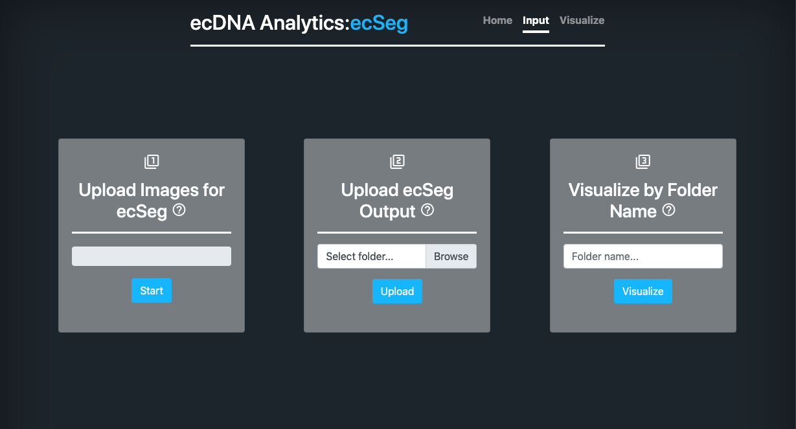

# ecDNA-Analytics

Web platform that integrates the metaDetect and ecSeg  tools with respective visualizations for the purpose of extrachromosomal DNA analysis. View at <http://genomequery.ucsd.edu:5000/>

## Tools

### metaDetect

(<https://github.com/MihirBafna/MetaDetect>)
metaDetect is a platform for identifying metaphase spreads in a population of cells from whole slide images (experimental)

### ecSeg

(<https://github.com/UCRajkumar/ecSeg>)
ecSeg is a platform designed to identify extrachromosomal DNA (ecDNA) from metaphase images stained with DAPI and FISH probes (Rajkumar, U. iScience 2019)

## Online Usage

* View webtool at <http://genomequery.ucsd.edu:5000/>

### Use ecSeg

* Navigate to the ecSeg 'Input' page shown below:
   

   * Panel 1 - This input panel is for users who want to actually run ecSeg on tif images before visualizing. To run ecSeg, select a folder containing input images (DAPI / FISH metaphase spreads, TIF only). ecSeg takes time to run, so try to limit input folders to ten images maximum. After ecSeg is run, the output images will be visualized. Save the timestamped folder name for future reference.
   
   * Panel 2 - This input panel is for users who already have run ecSeg separately, and want to visualize the output. To visualize ecSeg output, select a directory containing subdirectories named 'labels', 'dapi', and optionally 'orig (all subdirectories must contain the same number of images with matching filenames). If the directory does not have an 'orig' folder, one will be created as long as the original images are located in the chosen directory. Once visualized, save the timestamped folder name for future reference.

   * Panel 3 - This input panel is for users who want to visualize an ecSeg outputted folder that has already been recorded and stored on the genomequery server. To visualize a folder already uploaded to the server, type the timestamped folder name (Format: YYYY-MM-DD_HHMMSS).


* Once input folders have been selected, the user will be redirected to the visualize page shown below:
   
   
   * Image Magnification - to display the magnified images, the user must double click on the top row of images and a white selection box will appear. Clicking one more time will freeze the selection and detatch the mouse from the selector box. Magnified images are shown in the row below.
   
   * Page Layout - On this visualize page, the images displayed going from left to right are the original inputted image, the grayscaled dapi image, and the ecSeg output image. The two image sections below the first row of images are deafulted to the magnified (10x) versions of the original image and the ecSeg output image respectively. User can toggle between the magnified version of the original adn the grayscaled dapi via the toolbar.
   
   * Select Image - On the top left corner of the page is the image select button. Once clicked, a side panel will open up listing the names of every single input image for the user to select and appropriately visualize. The timestamped folder name is labelled at the top. Save this folder name for future reference and usage.
   
   * Toolbar - On the top right corner of the page is the toolbar button. Once the button is clicked, a side panel will open up and display the different tools users have to their advantage. The buttons and their explanations are listed below:
   
      * orig/dapi toggle - toggles the magnified image on the bottom left to either the original or the grayscaled dapi image.
      
      * annotate - this feature is not implemented yet.
      
      * download image - this button will zip the original, grayscaled dapi, and ecSeg output images of the current visualized image name and download it for the user.
      * download folder - this button will zip the entire current timestamped folder stored on the server (including the orig, dapi, and labels subfolders) and download it for the user.
      
      * report github issue - this button sends the user to the issue page for this github repository. The User can create a new issue or view past issues.
      
      * clear client cache - everytime a user clicks one of the download buttons (listed above) a zip filed is created and stored on the server's client folder. Periodically, one could clear the client cache by clicking this button and free up space. Eventually, we will look to automate this process, but for right now it can be used by developers running locally.

### Use metaDetect

* IN DEVELOPMENT

## Local Installation (for developers)

NOTE THAT THIS APP IS IN DEVELOPMENTAL STAGE

1. Clone this repository into a local folder of your choice

2. Navigate into repository and set up a virtual environment (conda is recommended)
    * Using conda:

    ```bash
    conda env create -f environment.yml
    conda activate env 
    ```

    * Using pip:

    ```bash
    python3 -m venv env
    source env/bin/activate
    ```

3. (For pip only) Recursively install all dependencies into your virtual environment (requirements.txt is provided)

    * Using pip:

    ```bash
     pip install -r requirements.txt
     ```

4. Setup flask developmental server

    ```bash
    export FLASK_APP=run.py
    export FLASK_ENV=development
    ```

## Local Usage

Whenever starting up the server, do the following:

1. Activate your virtual environment
    * Using Conda:  

   ```bash
   conda activate env 
   ```

    * Using pip:
    
    ```bash
    source env/bin/activate
    ```

2. Run application

    ```bash
    flask run
    ```

3. Developmental server will be running on ```localhost:5000``` in your web browser

4. Once done using application, deactivate your virtual environment with either ```deactivate``` or ```conda deactivate```

